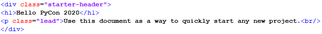

# Write Less and Test More with<br> Data Regression Testing

Igor T. Ghisi

---

## About Me

- Tech Lead at **ESSS**
- Started with Python on 2.3
- pytest advocate

## About ESSS

- Custom Scientific Software
- Python since 2003

www.esss.co


---

## About ESSS

- Custom Scientific Software
- Stack: Python & C++
- Python since 2003


---


- 13.000+ tests
- Python 2to3 in 2018
- 1.5M LoC, 10 months

rocky.esss.co


---


---

# Whetting Your Appetite

---
<!-- header: Whetting Your Appetite -->

```python
@dataclass
class CarSpec:
    manufacturer: str
    model: str
    transmission: Transmission
    year: int
    displacement: float  # in cc
    power: float  # in hp
    torque: float  # in Nm


def create_car_from_name(name):
    """Search in some database and return a Car"""
    ...
```
---

before...

```python
def test_create_car_from_name():
    car_spec = create_car_from_name("Toyota Corolla 1999")

    assert car_spec.manufacturer == "Toyota"
    assert car_spec.model == "Corolla"
    assert car_spec.transmission == Transmission(n_speed=5, type_=TR_MANUAL)
    assert car_spec.year == 1999
    assert car_spec.power == 120
    assert car_spec.torque == 165
```

---
after...

```python
def test_car_regression(data_regression):
    car_spec = create_car_from_text("Toyota Corolla 1999")
    data_regression.check(asdict(car_spec))
```

---
<!-- header: "" -->

# Data Regression Testing

---
<!-- header: Data Regression Testing -->
<!-- _footer: 1 Anirban Basu. _Software Quality Assurance, Testing and Metrics_. PHI Learning Pvt. Ltd., 2015  -->


> Regression testing is done to ensure that a change in the code... ...has not introduced any new defect.¹

---

Data regression testing is used to prevent software regression based on data comparisson

<footer>
Redfin Engineering, <a herf=https://redfin.engineering/regression-testing-data-94d2cc450ea8>Regression Testing Data</a>. Code Red - The Redfin Engineering Blog.<br>
Pratik Satasiya, <a href=https://dzone.com/articles/how-to-perform-database-regression-testing>How to Perform Database Regression Testing?</a> DZone.com<br>
John Hunter et. al., <a href=https://matplotlib.org/3.1.1/devel/contributing.html#building-matplotlib-for-image-comparison-tests>Contributing — Matplotlib 3.1.2 documentation</a>. Matplotlib: Python plotting
</footer>

---
<!-- header: "" -->

# pytest

---


---

<!-- header: "" -->

# When "test first" doesn't fit

---
<!-- header: When "test first" doesn't fit  -->

Quadratic Bezier Curve


---

Naive approach
```python
def test_quadratic_bezier():
    x, y = quadratic_bezier((1, 1), (0, 0), (1, 0))
    assert (x[0], y[0]) == (1, 1)
    assert (x[99], y[99]) ==  (1, 0)

```

---

Naive approach
```python
x, y = quadratic_bezier((1, 1), (0, 0), (1, 0))
print(x[50], y[50])
>>> 0.5000510152025304, 0.2449750025507601
```

```python
def test_quadratic_bezier():
    x, y = quadratic_bezier((1, 1), (0, 0), (1, 0))
    assert (x[0], y[0]) == (1, 1)
    assert (x[99], y[99]) ==  (1, 0)
    assert (x[50], y[50]) == (0.5000510152025304, 0.2449750025507601)
```

---
<!-- header: "" -->

`pytest-regressions`

---
<!-- header: pytest-regressions -->

## Installation

`pip install pytest-regressions`

or 

`conda install -c conda-forge pytest-regressions`

## Docs

pytest-regressions.readthedocs.io

---

## `pytest-regressions` fixtures:

1. `num_regression`: for numerical data
1. `data_regression`: for objects or dict-like data
1. `file_regression`: for text files

---
<!-- header: "" -->

`num_regression`

---

<!-- header: num_regression  -->

Regression approach

```python
def test_bezier_regression(num_regression):
    x, y = quadratic_bezier((1, 1), (0, 0), (1, 0))
    num_regression.check({'x': x, 'y': y})
```

---

Defining tolerance

```python
def test_bezier_regression(num_regression):
    x, y = quadratic_bezier((1, 1), (0, 0), (1, 0))
    num_regression.check(
        {'x': x, 'y': y},
        default_tolerance=dict(atol=1e-3)
    )
```

---
<!-- _footer: See [numpy.isclose docs](http://docs.scipy.org/doc/numpy/reference/generated/numpy.isclose.html) for more details on **atol** and **rtol**  -->


Defining tolerance

```python
def test_bezier_regression(num_regression):
    x, y = quadratic_bezier((1, 1), (0, 0), (1, 0))
    num_regression.check(
        {'x': x, 'y': y},
        tolerances={'x': dict(atol=1e-3, rtol=1e-6)}
    )
```

---
<!-- header: "" -->

`file_regression`

---
<!-- header: file_regression  -->
<!-- _footer: Markdonify code obtained from https://github.com/matthewwithanm/python-markdownify -->


```python
def test_markdownify(file_regression):
    html = '''<h1>Test Data</h1>

    <a href="http://nowhere">this is a link</a>

    <p>Mussum Ipsum, cacilds vidis litro abertis. Diuretics paradis
    num copo e motivis de denguis. Manduma pindureta quium dia nois
    paga.</p>

    '''
    markdown = markdownify(html)
    file_regression.check(markdown, extension=".md")
```

---

```python
app = Flask(__name__)

@app.route('/')
def hello_world():
    return render_template('hello.html', name='PyCon 2020')
```

---

Naive approach
```python
def test_flask_hello(client):
    resp = client.get('/')
    assert resp.status_code == 200
    "Hello Flask Conf" in resp.data.decode()
```

---

Regression approach
```python
def test_flask_hello(client, file_regression):
    resp = client.get('/')
    assert resp.status_code == 200
    file_regression.check(resp.data.decode(), extension=".html")
```

---

test_flask_hello.html


---

Regression approach (better)
```python
def test_flask_hello(client, file_regression):
    resp = client.get('/')
    assert resp.status_code == 200

    soup = BeautifulSoup(resp.data.decode(), 'html.parser')
    main_div_element = soup.select_one('.starter-header')
    file_regression.check(str(main_div_element), extension=".html")
```

---

test_flask_hello.html



---
<!-- header: "" -->

`data_regression`

---
<!-- header: data_regression -->

```python
@dataclass
class Car:
    manufacturer: str
    model: str
    transmission: Transmission
    year: int
    displacement: float  # in cc
    power: float  # in hp
    torque: float  # in Nm


def create_car_from_name(name):
    """Search in some database and return a Car"""
    ...
```

---

```python
def test_create_car_from_name(data_regression):
    car = create_car_from_text("Mazda MX-5 2015")
    data_regression.check(asdict(car))
```

---

test_create_car_from_name.yml

```yml
displacement: 1998
manufacturer: Mazda
model: MX-5
power: 158
torque: 200
transmission:
  n_speed: 5
  type_: manual
year: 2015
```

---

```python
HEROES = [
    {'id': 1, 'name': 'Mr. Nice', 'Birth': datetime(2000, 10, 19)},
    {'id': 2, 'name': 'Bombasto', 'Birth': datetime(1996, 11, 3)},
    {'id': 3, 'name': 'Magneta', 'Birth': datetime(1980, 12, 9)},
    {'id': 4, 'name': 'RubberMan', 'Birth': datetime(1985, 9, 17)},
    {'id': 5, 'name': 'Dr IQ', 'Birth': datetime(1998, 3, 18)},
]
```

---

```python
@app.route('/api/heroes')
def heroes_collection():
    return jsonify(HEROES)


@app.route('/api/heroes/<int:hero_id>')
def heroes_item(hero_id):
    for hero in HEROES:
        if hero_id == hero['id']:
            return jsonify(hero)
    else:
        return "Error", 404
```

---

```python
def test_heroes_item(client, data_regression):
    resp = client.get('/api/heroes/4')
    assert resp.status_code == 200
    data_regression.check(resp.get_json())


def test_heroes_collection(client, data_regression):
    resp = client.get('/api/heroes')
    assert resp.status_code == 200
    data_regression.check(resp.get_json())

```

---

test_heroes_item.yml
```yml
Birth: Tue, 17 Sep 1985 00:00:00 GMT
id: 4
name: RubberMan
```

---

test_heroes_collection.yml
```yml
- Birth: Thu, 19 Oct 2000 00:00:00 GMT
  id: 1
  name: Mr. Nice
- Birth: Sun, 03 Nov 1996 00:00:00 GMT
  id: 2
  name: Bombasto
- Birth: Tue, 09 Dec 1980 00:00:00 GMT
  id: 3
  name: Magneta
- Birth: Tue, 17 Sep 1985 00:00:00 GMT
  id: 4
  name: RubberMan
  ...
```

---
<!-- header: "" -->

`image_regression`


---
<!-- header: image_regression -->

```python
def generate_3d_plot(output_filename):
    X = np.arange(-5, 5, 0.25)
    Y = np.arange(-5, 5, 0.25)
    X, Y = np.meshgrid(X, Y)
    R = np.sqrt(X**2 + Y**2)
    Z = np.sin(R)

    fig = plt.figure()
    ax = Axes3D(fig)
    ax.plot_surface(
        X, Y, Z, rstride=1, cstride=1,
        cmap=cm.viridis
    )

    plt.savefig(output_filename, format='png')
```


---

```python
def test_generate_3d_plot(image_regression):
    buffer = BytesIO()
    generate_3d_plot(buffer)
    image_regression.check(buffer.getvalue())
```
