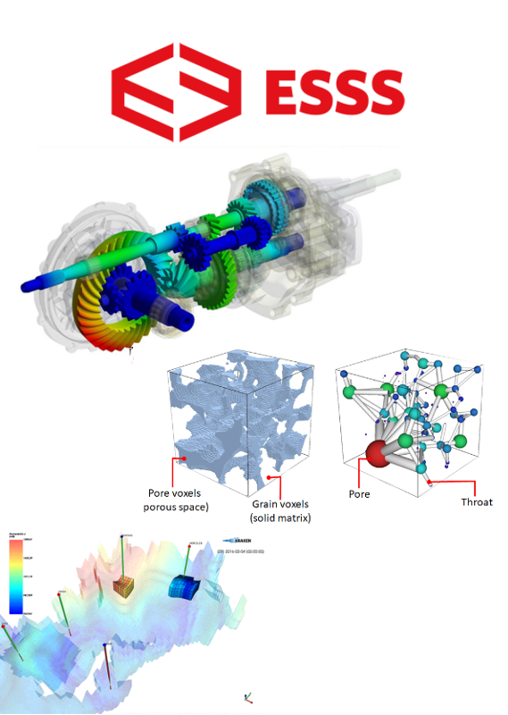

# Write Less and Test More with<br> Data Regression Testing

Igor T. Ghisi

---

## About Me

- Live in Florianópolis, Brazil
- M.Sc. in Computational Mechanics
- Tech Lead at **ESSS**
- Started with Python on v2.3


---

## About ESSS

- Custom Scientific Software
- Stack: Python & C++
- Python since 2003

www.esss.co




---


- 13.000+ tests
- Python 2to3 in 2018
- 1.5M LoC, 10 months

rocky.esss.co


---


---

## Whetting Your Appetite

---
<!-- header: Whetting Your Appetite -->

```python
@dataclass
class CarSpec:
    manufacturer: str
    model: str
    transmission: Transmission
    year: int
    displacement: float  # in cc
    power: float  # in hp
    torque: float  # in Nm


def create_car_from_name(name):
    """Search in some database and return a Car"""
    ...
```

---

before...

```python
def test_create_car_from_name():
    car_spec = create_car_from_name("Toyota Corolla 1999")

    assert car_spec.manufacturer == "Toyota"
    assert car_spec.model == "Corolla"
    assert car_spec.transmission == Transmission(n_speed=5, type_=TR_MANUAL)
    assert car_spec.year == 1999
    assert car_spec.power == 120
    assert car_spec.torque == 165
```

---
after...

```python
def test_car_regression(data_regression):
    car_spec = create_car_from_text("Toyota Corolla 1999")
    data_regression.check(asdict(car_spec))
```

---
<!-- header: "" -->

# Data Regression Testing

---
<!-- header: Data Regression Testing -->
<!-- _footer: 1 Anirban Basu. _Software Quality Assurance, Testing and Metrics_. PHI Learning Pvt. Ltd., 2015  -->


> Regression testing is done to ensure that a change in the code... ...has not introduced any new defect.¹

---

Data regression testing is used to prevent software regression by comparing output data of a code that has changed to the data generated by a previous version of the same code.

<footer>
Redfin Engineering, <a herf=https://redfin.engineering/regression-testing-data-94d2cc450ea8>Regression Testing Data</a>. Code Red - The Redfin Engineering Blog.<br>
Pratik Satasiya, <a href=https://dzone.com/articles/how-to-perform-database-regression-testing>How to Perform Database Regression Testing?</a> DZone.com<br>
John Hunter et. al., <a href=https://matplotlib.org/3.1.1/devel/contributing.html#building-matplotlib-for-image-comparison-tests>Contributing — Matplotlib 3.1.2 documentation</a>. Matplotlib: Python plotting
</footer>

---
<!-- header: "" -->

## `pytest-regressions`

---
<!-- header: "" -->

# pytest


---
<!-- header: pytest-regressions -->

## Installation

`pip install pytest-regressions`

or 

`conda install -c conda-forge pytest-regressions`

## Docs

pytest-regressions.readthedocs.io

---

## `pytest-regressions` fixtures:

1. `num_regression`: for numerical data
1. `file_regression`: for generic text files
1. `data_regression`: for objects or dict-like data
1. `image_regression`: for images

---
<!-- header: "" -->

## `num_regression`

---

## When "test first" doesn't fit

---
<!-- header: num_regression  -->
<!-- _footer: Wikipedia, Bézier curve. https://en.wikipedia.org/wiki/B%C3%A9zier_curve -->

_Generating 100 points quadratic bezier curve_

###  Quadratic Bezier Curve


---

```python
def test_quadratic_bezier():
    x, y = quadratic_bezier((1, 1), (0, 0), (1, 0))
    assert (x[0], y[0]) == (1, 1)
    assert (x[99], y[99]) ==  (1, 0)

```

---

```python
def quadratic_bezier(p0, p1, p2, num_points=100):
    '''
    Quadratic bezier implementation for 3 control points.
    '''
    t = np.linspace(0, 1, num_points)
    x = (1 - t) ** 2 * p0[0] + 2 * (1 - t) * t * p1[0] + t ** 2 * p2[0]
    y = (1 - t) ** 2 * p0[1] + 2 * (1 - t) * t * p1[1] + t ** 2 * p2[1]
    return x, y

```

---

Naive approach
```python
x, y = quadratic_bezier((1, 1), (0, 0), (1, 0))
print(x[50], y[50])
>>> 0.5000510152025304, 0.2449750025507601
```

```python
def test_quadratic_bezier():
    x, y = quadratic_bezier((1, 1), (0, 0), (1, 0))
    assert (x[0], y[0]) == (1, 1)
    assert (x[99], y[99]) ==  (1, 0)
    assert (x[50], y[50]) == (0.5000510152025304, 0.2449750025507601)
```

---

## The `pytest-regression` approach

---

```python
def test_bezier_regression(num_regression):
    x, y = quadratic_bezier((1, 1), (0, 0), (1, 0))
    num_regression.check({'x': x, 'y': y})
```

---

Defining tolerance

```python
def test_bezier_regression(num_regression):
    x, y = quadratic_bezier((1, 1), (0, 0), (1, 0))
    num_regression.check(
        {'x': x, 'y': y},
        default_tolerance=dict(atol=1e-3)
    )
```

---
<!-- _footer: See [numpy.isclose docs](http://docs.scipy.org/doc/numpy/reference/generated/numpy.isclose.html) for more details on **atol** and **rtol**  -->


Defining tolerance

```python
def test_bezier_regression(num_regression):
    x, y = quadratic_bezier((1, 1), (0, 0), (1, 0))
    num_regression.check(
        {'x': x, 'y': y},
        tolerances={'x': dict(atol=1e-3, rtol=1e-6)}
    )
```

---
<!-- header: "" -->

## `file_regression`

---
<!-- header: file_regression  -->
<!-- _footer: Markdonify code obtained from https://github.com/matthewwithanm/python-markdownify -->

```python
def markdownify(html, **options):
    '''Convert HTML to Markdown'''
    ...
```

---


```python
def test_markdownify(file_regression):
    html = '''<h1>Test Data</h1>

    <a href="http://nowhere">this is a link</a>

    <p>Mussum Ipsum, cacilds vidis litro abertis. Diuretics paradis
    num copo e motivis de denguis. Manduma pindureta quium dia nois
    paga.</p>

    '''
    markdown = markdownify(html)
    file_regression.check(markdown, extension=".md")
```

---

In case of regression, a nice text diff is shown

```
AssertionError: FILES DIFFER:

HTML DIFF: ..\test_markdownify\test_markdownify.obtained.diff.html
--- 
+++ 
@@ -1,5 +1,5 @@
-Test Data
-=========
+Test Other
+==========
 
  Mussum Ipsum, cacilds vidis litro abertis. Diuretics paradis
  num copo e motivis de denguis. Manduma pindureta quium dia nois paga.
```

---


---

`templates/hello.html`
```html
<html>
  <div class="starter-header">
    <h1>Hello {{ name }}</h1>
  </div>
</html>
```

`app.py`
```python
app = Flask(__name__)

@app.route('/hello')
def hello_world():
    return render_template('hello.html', name='PyCon 2020')
```

---

Naive approach
```python
def test_flask_hello(client):
    resp = client.get('/hello')
    assert resp.status_code == 200
    "Hello Pycon 2020" in resp.data.decode()
```

---

Regression approach
```python
def test_flask_hello(client, file_regression):
    resp = client.get('/')
    assert resp.status_code == 200
    file_regression.check(resp.data.decode(), extension=".html")
```

---

Real HTML file


---

Using _BeautifulSoup_ to do regression only<br> for the `<body>` of the page
```python
def test_flask_hello(client, file_regression):
    resp = client.get('/')
    assert resp.status_code == 200

    soup = BeautifulSoup(resp.data.decode(), 'html.parser')
    body_element = soup.select_one('body')
    file_regression.check(str(body_element), extension=".html")
```

---
<!-- header: "" -->

## `data_regression`

---
<!-- header: data_regression -->

```python
@dataclass
class CarSpec:
    manufacturer: str
    model: str
    transmission: Transmission
    year: int
    displacement: float  # in cc
    power: float  # in hp
    torque: float  # in Nm


def create_car_from_name(name):
    """Search in some database and return a Car"""
    ...
```

---

```python
def test_create_car_from_name(data_regression):
    car = create_car_from_text("Toyota Corolla 1999")
    data_regression.check(asdict(car))
```

---

`test_car/test_create_car_from_name.yml`

```yml
displacement: 1794
manufacturer: Toyota
model: Corolla
power: 120
torque: 50
transmission:
  n_speed: 5
  type_: manual
year: 1999
```

---

```
AssertionError: FILES DIFFER:

HTML DIFF: ..\test_car\test_create_car_from_name.obtained.diff.html
--- 
+++ 
@@ -4,6 +4,6 @@
 power: 120
 torque: 165
 transmission:
-  n_speed: 5
-  type_: manual
+  n_speed: 4
+  type_: automatic
 year: 1999
```

---

`data_regression` with Web APIs

```python
HEROES = [
    {'id': 1, 'name': 'Mr. Nice', 'Birth': datetime(2000, 10, 19)},
    {'id': 2, 'name': 'Bombasto', 'Birth': datetime(1996, 11, 3)},
    {'id': 3, 'name': 'Magneta', 'Birth': datetime(1980, 12, 9)},
    {'id': 4, 'name': 'RubberMan', 'Birth': datetime(1985, 9, 17)},
    {'id': 5, 'name': 'Dr IQ', 'Birth': datetime(1998, 3, 18)},
]
```

---

```python
@app.route('/api/heroes/<int:hero_id>')
def heroes_item(hero_id):
    for hero in HEROES:
        if hero_id == hero['id']:
            return jsonify(hero)
    else:
        return "Error", 404


@app.route('/api/heroes')
def heroes_collection():
    return jsonify(HEROES)
```

---

```python
def test_heroes_item(client, data_regression):
    resp = client.get('/api/heroes/4')
    assert resp.status_code == 200
    data_regression.check(resp.get_json())


def test_heroes_collection(client, data_regression):
    resp = client.get('/api/heroes')
    assert resp.status_code == 200
    data_regression.check(resp.get_json())

```

---

test_heroes_item.yml
```yml
Birth: Tue, 17 Sep 1985 00:00:00 GMT
id: 4
name: RubberMan
```

---

test_heroes_collection.yml
```yml
- Birth: Thu, 19 Oct 2000 00:00:00 GMT
  id: 1
  name: Mr. Nice
- Birth: Sun, 03 Nov 1996 00:00:00 GMT
  id: 2
  name: Bombasto
- Birth: Tue, 09 Dec 1980 00:00:00 GMT
  id: 3
  name: Magneta
- Birth: Tue, 17 Sep 1985 00:00:00 GMT
  id: 4
  name: RubberMan
  ...
```

---
<!-- header: "" -->

## `image_regression`


---
<!-- header: image_regression -->


```python
def generate_3d_plot(output_filename):
    X = np.arange(-5, 5, 0.25)
    Y = np.arange(-5, 5, 0.25)
    X, Y = np.meshgrid(X, Y)
    R = np.sqrt(X**2 + Y**2)
    Z = np.sin(R)

    fig = plt.figure()
    ax = Axes3D(fig)
    ax.plot_surface(
        X, Y, Z, rstride=1, cstride=1,
        cmap=cm.viridis
    )

    plt.savefig(output_filename, format='png')
```


<footer>
    John Hunter et. al., <a href=https://matplotlib.org/gallery/pyplots/whats_new_99_mplot3d.html#whats-new-0-99-mplot3d>Whats New 0.99 Mplot3d</a>. Matplotlib: Python plotting 
</footer>

---

```python
def test_generate_3d_plot(image_regression):
    buffer = BytesIO()
    generate_3d_plot(buffer)
    image_regression.check(buffer.getvalue())
```

---

Regression failure message

```
AssertionError: Difference between images too high: 1.06 %
...\tmp\pytest\test_mpl_plot3d\test_generate_3d_plot.png
...\tmp\pytest\test_mpl_plot3d\test_generate_3d_plot.obtained.png

```

---

Comparisson threshold can be customized

```python
image_regression.check(buffer.getvalue(), diff_threshold=5)
```

---

## something

--- 

Regenarate all regression files

`$ pytest --force-regen`

---

`num_regression` and `image_regression` dependencies are not automatically installed
<br>

* `pip install pandas` - for `num_regression`
* `pip install pillow` - for `image_regression`

---

## Bonus Round
<br>


---

## `pytest-datadir`

`pip install pytest-datadir`

---

Files placed in a directory using the samen name of the test file 
will be available through the `datadir` fixture

```
├── test_count_lines/
│   └── support_file.txt
└── test_count_lines.py
```
<br>

Test function
```python
def test_count_text_file_lines(datadir):
    num_lines = count_lines(str(datadir / 'support_file.txt'))
    assert num_lines == 12
```

---

```
├── test_txt_formatter/
│   └── tabbed_file.txt
└── test_txt_formatter.py
```
<br>

Test function
```python
def test_convert_tab_to_spaces(datadir):
    tab_to_spaces(
        input_file=str(datadir / 'tabbed_file.txt')
        output_file=str(datadir / 'spaced_file.txt')
        )
    assert '\t' not in (datadir / 'spaced_file.txt').read_text()
```

--- 

Test function
```python
def test_convert_tab_to_spaces(datadir):
    tab_to_spaces(
        input_file=str(datadir / 'tabbed_file.txt')
        output_file=str(datadir / 'spaced_file.txt')
        )
    spaced_file_contents = (datadir / 'spaced_file.txt').read_text()
    file_regression.check(spaced_file_contents)
```

---

## `serialchemy`

`pip install serialchemy`

---

```python
class User(Base):
    __tablename__ = 'users'
    
    id = Column(Integer, Sequence('user_id_seq'), primary_key=True)
    name = Column(String(50))
    fullname = Column(String(50))
    nickname = Column(String(50))
    address_id = Column(Integer, ForeignKey('addresses.id'))
    address = relationship("Adresss")


class Address(Base):

    __tablename__ = 'addresses'
    
    id = Column(Integer, primary_key=True)
    street = Column(String)
    city = Column(String)
```

---

```python
def test_user(session, data_regression):
    user = session.query(User).filter_by(name='John').first()
    serialized = serialchemy.dump(user, nest_foreign_keys=True)
    data_regression.check(serialized)
```

---

`test_model/test_user.yml`
```
address:
  city: New York
  id: 1
  street: 5th Avenue
fullname: null
id: 1
name: Michael
nickname: Mike
```

---

- `pytest-regressions`
    - `num_regression`: dict of 1-D arrays
    - `file_regression`: text
    - `data_regression`: basic python types
    - `image_regression`: image binary
- `pytest-datadir`:
    - `datadir`: Path object to a temp dir
- `serialchemy`: serialization of SQLAlchemy models

---


https://pytest.readthedocs.io


---

# Thanks

 figortg
